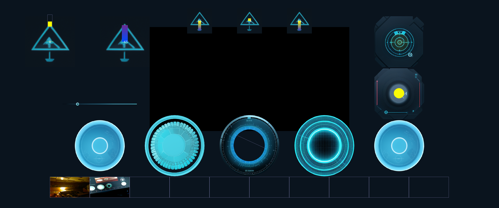
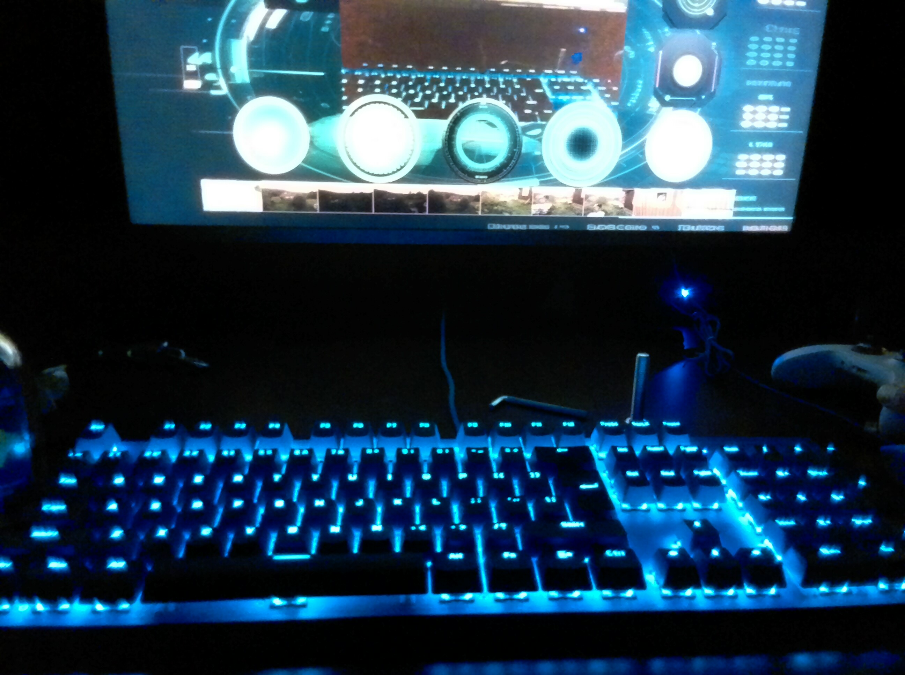

# rust-tello-controller


Control DJI Ryze Tello from rust with XBOX gamepad

## Quick Start

```bash
sudo apt install  libsdl2-gfx-dev libsdl2-image-dev libsdl2-dev libsdl2-ttf-dev
cargo build --release
target/release/rust-tello-controller &> flight_log
```

Note: DO NOT use `cargo run` or debug build. The h264 video needs to be optimized and in debug builds 
there's a signifficant delay in video decoding.

## Gauge Description

from left to right, from top to bottom:
* battery;  drone temperature, approx 75 is red; Vx, Vy, Vz;  Wifi signal strength
* sensitvity setup; video screen ;  light health 
* left stick; yaw; horizon; flight log; right stick
* taken pictures carousel





## Handling

* `A` - take picture
* `B` - toggle video on/off (default is off)
* `X` - zoom in image on the carousel
* `Horiz` - left/right - rotate the carousel
* `Left stick` - forward/slide
* `Right stick` - turn left/right
* `RT` - move up
* `LT` - move down
* `RB` - sensitivity up
* `LB` - sensitivity down

## Example Images

These images were taken with tello 5Mpx camera:

